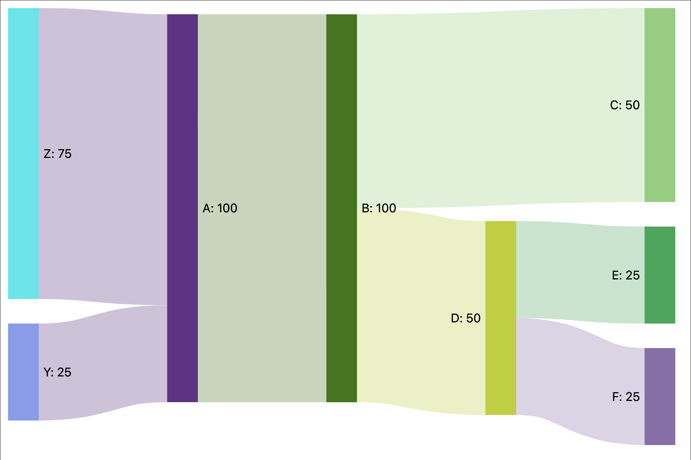
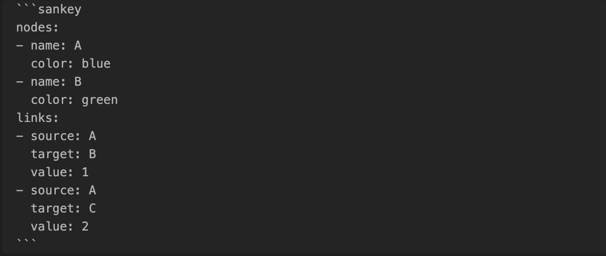
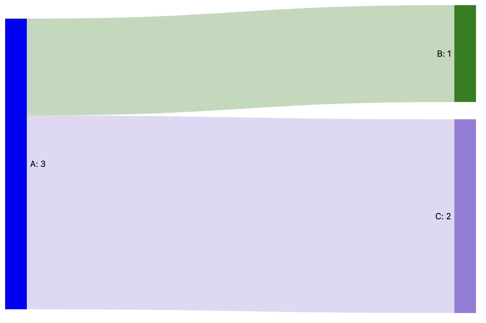

# Sankey Diagrams for Obsidian

Create Sankey diagrams in Obsidian.

## Usage

To generate a Sankey diagram, create a `sankey` code block.
Sankey diagrams consist of links and nodes that can be specified using YAML.

#### Links
Links are created using a source, a target and a value.

#### Nodes
Nodes can be explicitly created to add a specific color to a node.
If none or not all nodes are added to the code block, the rest of the nodes will be inferred from the link targets and sources.

## Examples
#### Basic Example
A simple example using only links.

Results in:

#### Node colors
An example specifying the colors for nodes A and B.

Results in:

